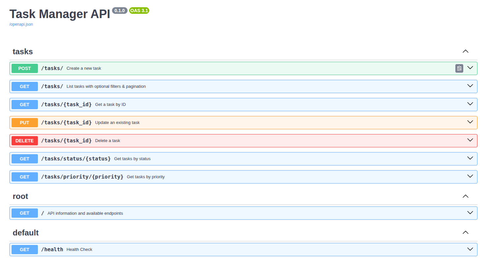

## Task Management API

A simple, containerized Task Management RESTful API built with **FastAPI**, **Pydantic**, and **SQLModel**, using **SQLite** as the database.

---

### Table of Contents

* [Features](#features)
* [Getting Started](#getting-started)

  * [Prerequisites](#prerequisites)
  * [Installation](#installation)
  * [Environment Variables](#environment-variables)
  * [Database Setup](#database-setup)
  * [Running the Application](#running-the-application)
  * [Running with Docker](#running-with-docker)
* [Project Structure](#project-structure)
* [API Endpoints](#api-endpoints)
* [Filtering, Sorting & Pagination](#filtering-sorting--pagination)
* [Testing](#testing)
* [Sample Data](#sample-data)
* [Bonus Features](#bonus-features)
* [License](#license)

---

## Features

* **CRUD** operations for tasks
* **Data Validation** with Pydantic models
* **Pagination** using `skip`/`limit`
* **Database Integration** Proper SQLModel/SQLAlchemy integration
* **Filtering** by status and priority
* **Automatic API docs** via OpenAPI and Swagger UI

---
## Bonus Features

* **Advanced Filtering**: multiple simultaneous filters in service layer
* **Sorting**: by timestamps and due date, `sort_by` & `sort_order` support
* **Unit Tests**: basic coverage with pytest for core functionality
* **Docker**: containerized application

---
## Getting Started

### Prerequisites

* Python 3.9 or higher
* `pip` package manager
* (Optional) Docker & Docker Compose

### Installation

1. Clone the repository:

   ```bash
   git clone https://github.com/Muhammed-Mndour/Task-Manager.git
   cd task-manager-api
   ```
2. Create & activate a virtual environment:

   ```bash
   python -m venv venv
   source venv/bin/activate   
   ```
3. Install dependencies:

   ```bash
   pip install -r requirements.txt
   ```

### Environment Variables

Create a `.env` (if using) to override defaults (optional):

```
DATABASE_URL=sqlite:///./tasks.db
HOST=0.0.0.0
PORT=8000
```

### Database Setup

On startup, the application will auto-create the SQLite database and tables:

```
python -m src.main
```

### Running the Application

```bash
uvicorn src.main:app --reload --host $HOST --port $PORT
```

Visit `http://localhost:8000/docs` for API docs.

### Running with Docker

1. Build the image:

   ```bash
   docker build -t task-manager-api .
   ```
   
2. Run the container:
    ```bash
    docker run -d --name task_api -p 8000:80 task-manager-api
    ````

---

## Project Structure

```
├── Dockerfile
├── requirements.txt
├── pyproject.toml
├── src/
│   ├── data/models.py        # SQLModel definitions & DB session
│   ├── domain/schemas.py     # Pydantic models & enums
│   ├── domain/tasks.py       # Business logic services
│   ├── views/tasks.py        # FastAPI routes
│   └── main.py               # App setup & router inclusion
├── tasks.db                  # SQLite database (auto-created)
└── tests/
    └── test_tasks.py         # Pytest test cases
```

---

## API Endpoints

| Method | Path                     | Description                    |
| ------ | ------------------------ | ------------------------------ |
| GET    | `/`                      | API info & available endpoints |
| GET    | `/health`                | Health check                   |
| GET    | `/tasks`                 | List tasks                     |
| POST   | `/tasks`                 | Create a new task              |
| GET    | `/tasks/{task_id}`       | Retrieve task by ID            |
| PUT    | `/tasks/{task_id}`       | Update an existing task        |
| DELETE | `/tasks/{task_id}`       | Delete a task                  |
| GET    | `/tasks/status/{status}` | Filter tasks by status         |
| GET    | `/tasks/priority/{prio}` | Filter tasks by priority       |
| GET    | `/docs`                  | Swagger UI                     |
| GET    | `/openapi.json`          | OpenAPI JSON spec              |

---

## Filtering, Sorting & Pagination

* **Filtering**: `status`, `priority` as query parameters on `/tasks`
* **Sorting**: `sort_by` (one of `created_at`, `updated_at`, `due_date`) and `sort_order` (`asc` or `desc`)
* **Pagination**: `skip` & `limit` query parameters (defaults: `skip=0`, `limit=10`)

Example:

```
GET /tasks?status=pending&priority=high&sort_by=due_date&sort_order=asc&skip=0&limit=5
```

---

## Testing

### Sample Data(some API calls)

Populate the API with sample tasks using the following API calls:

```bash
# Create sample tasks
curl -X POST "http://localhost:8000/tasks/" \
     -H "Content-Type: application/json" \
     -d '{"title": "Sample Task 1", "description": "This is a test task.", "priority": "medium", "due_date": "2025-07-15T12:00:00Z", "assigned_to": "Bob"}'

curl -X POST "http://localhost:8000/tasks/" \
     -H "Content-Type: application/json" \
     -d '{"title": "Sample Task 2", "priority": "high"}'

# Retrieve all tasks
curl -X GET "http://localhost:8000/tasks/"
```

1. Ensure dependencies are installed.
2. Run pytest in the project root:

   ```bash
   pytest
   ```

All tests should pass, covering success & error cases.

---

## API Documentation (Swagger UI)

Below is a preview of the interactive API documentation:


